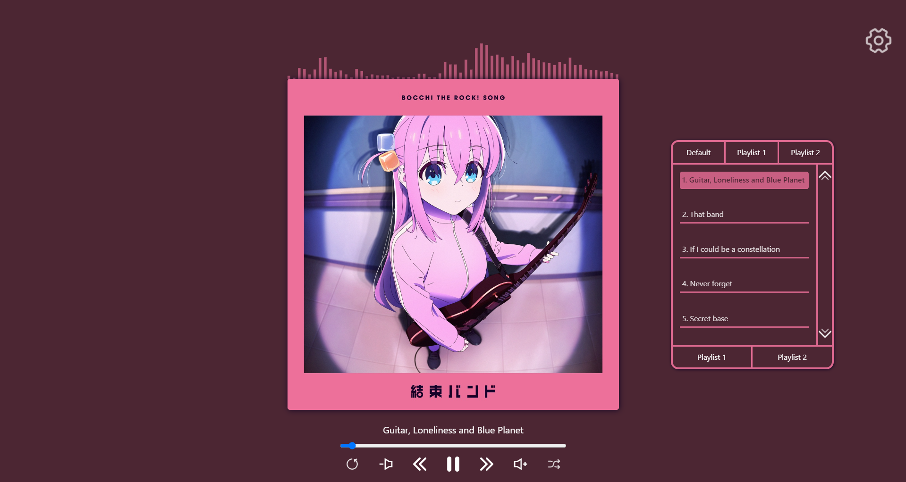
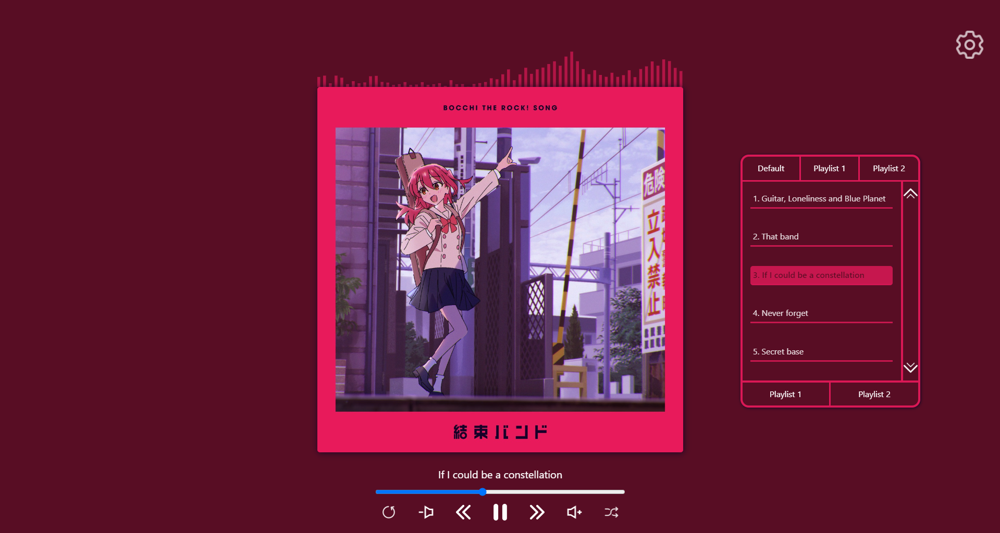

#  Bocchi the Rock Wallpaper
This is a web-based wallpaper inspired from the anime Bocchi the rock. This website features a music player and a playlist that allows users to browse the playlist
and create their own custom playlist.

##  Thumbnail


##  Other song & playlist


##  Steam Workshop Link:
[Bocchi the Rock! ぼっち・ざ・ろっく！(Album)](https://steamcommunity.com/sharedfiles/filedetails/?id=2905017768)

## To create your own custom playlist
You need to have Node/NPM to be installed in your system to be able to build the file into a static HTML file. Every song in the playlist is stored in the SongData.json, which is the file
that you'll need to edit for you to add custom songs. <br/>

##  SongData JSON structure
```json
{
    "id": 1,
    "name": "Guitar, Loneliness and Blue Planet", // Used to specify audio and singles cover filename. String is displayed on player and playlist.
    "nameOriginal": "ギターと孤独と蒼い惑星",
    "nameRomanized": "Guitar to Kodoku to Aoi Hoshi",
    "audioType": ".mp3", // Optional to specify another audio format. If null, fallback to .flac.
    "album": "", // Used to specify an album cover filename. If null, fallback to name.
    "backgroundColor": "#4C2633", // Color of the background. Colors are based from what YouTube provided.
    "clockTextShadow": "3px 3px rgba(237, 112 ,154 ,.7)", // Color for the text shadow, which is the primary color of the image.
    "lineColor": "rgba(237, 112 ,154 ,.9)", // Similar data as clocktextshadow.
    "playerTextShadow": "2px 2px rgba(237, 112 ,154 ,.7)" // Similar data as clocktextshadow.
  }
```
##  Built with
React JS - Front-End <br/>
localstorage - to store playlist data.
